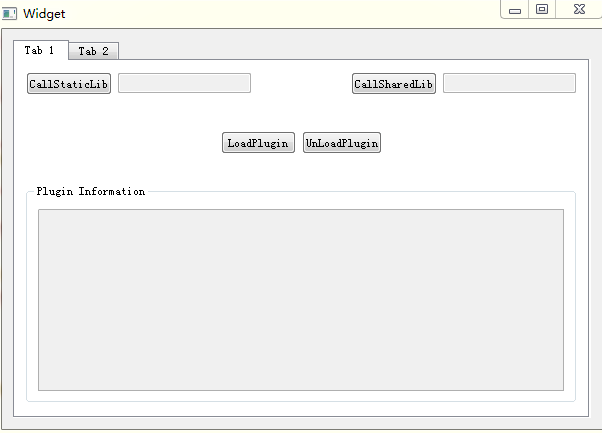

## Author
- **Welin**  2018.10.23
- modified in 2018.12.23

## Overview & Description
In the project, it provides how to make a cross-platform project by using qmake.
It shows how to create shared and static libraries, and use it in a whole completed project.
Also how to use the plugin when run the executable program, and how to unload the plugin when do not want to use it.
The Qt Creator IDE is better recommended. 

## TODO
Git clone the project, open the .pro file using QtCreator, and compile it, run it.

To execute the programer, it will work like this:

Enjoy!
